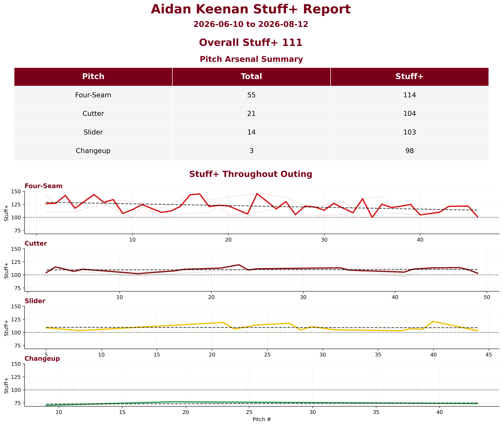
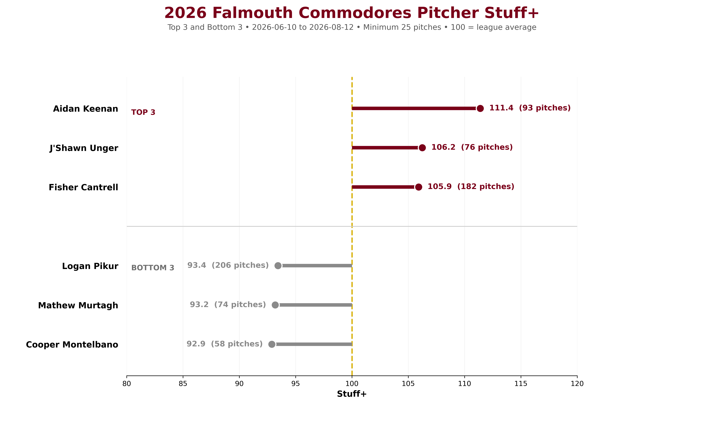

# CCBL Stuff+ Model

A location neutral pitch quality model built with Cape Cod Baseball League TrackMan data from the 2025 and 2026 seasons.

The model estimates whiff probability on swings from pitch characteristics, evaluates those predictions at a fixed grid of plate locations and both batter sides, and converts the resulting location neutral estimates to Stuff+. A score of **100 represents the 2025 pitch type and pitcher hand reference average**, with 10 points corresponding to approximately one reference standard deviation on the log odds scale before clipping and summary shrinkage.

**Current version: `CCBL-StuffPlus-G-v1.0`.** G retains the original velocity, movement, spin, release, extension, and adjusted angle features and adds measured flight time and fitted along-flight deceleration. It trains on 2025 data. The 2026 evaluation is **exploratory** because those results were examined during the comparison of model versions.

## Results

On 23,811 development swings from 321 pitchers, the G model improved pitcher-held-out 2025 log loss over the context-only model by **0.004901**, with a pitcher-clustered 95% bootstrap interval of **0.002571 to 0.007429**. The overall publication gate passed.

The separate comparison with the original model used the same manually classified sample and pitcher-held-out folds:

| Raw actual-location log loss | Original model | G |
| --- | ---: | ---: |
| 2025 pitcher-held-out validation | 0.491338 | 0.490179 |
| 2026 exploratory forward evaluation | 0.504650 | 0.502322 |

Lower log loss is better. The gain over the context-only model and the gain over the original full model are different comparisons. Additional 2025 fold assignments had positive point estimates in all three repeats, with positive 95% intervals in two. These repeats reuse the same development data and are not independent confirmation. Fresh data is needed to independently test the selected G model.

The packaged run scores **110,138 eligible pitches**: 53,927 from 2025 and 56,211 from 2026. The new time and fitted trajectory features had complete coverage on this prepared sample. See [G model details](docs/g-model.md) for feature definitions, validation, and limitations.

## How scoring works

The pipeline fits two XGBoost classifiers on swings:

- **Context:** pitch type, pitcher hand, batter side, and plate location.
- **Full:** context plus the measured and derived pitch characteristics.

Five-fold `GroupKFold` validation holds out whole pitchers. Preprocessing and angle adjustment are fitted within each training fold. The pipeline exports log loss, ROC AUC, PR AUC, Brier score, calibration diagnostics, pitcher-clustered intervals, and feature drift checks. Cross-fitted Platt scaling is a secondary calibration diagnostic; it is not a fully nested base-model/calibrator validation. Holdout calibration uses only 2025 out-of-fold predictions.

The full model is scored over nine fixed plate locations and both batter sides. Measured flight time and deceleration remain fixed during this averaging; no hypothetical trajectory is reconstructed. The resulting neutral probabilities are standardized against 2025 pitch type and pitcher hand references. Pitch-level scores are clipped to 40–160. Summary scores shrink toward 100 using 30 reference pitches.

## Validation tiers

Every pitch type and pitcher hand combination is scored, including groups that fail publication gates. Keep the tier alongside the score.

| Tier | Groups in the G run | Report code |
| --- | --- | --- |
| Published | Four-Seam, Left/Right; Two-Seam, Right | V |
| Pooled-Supported | Sinker, Left/Right; Slider, Left/Right; Splitter, Left | P |
| Rejected | Changeup, Left/Right; Curveball, Left/Right; Cutter, Left/Right; Splitter, Right; Two-Seam, Left | D |

Published groups passed the strict 2025 group confidence gates under the pooled model. Pooled-Supported groups had positive group estimates but inconclusive confidence intervals. Rejected groups are diagnostic only. A rejection indicates insufficient validation for that group, not that an individual pitch is poor.

The model requires manually reviewed **`MyPitchType`** labels. It does not fill blank model labels from `TaggedPitchType` or `AutoPitchType`. Reports may use `TaggedPitchType` for display, so a displayed arsenal category can contain more than one model category; its validation code uses the weakest included tier. Sweepers remain within the reviewed slider category.

## Running the project

Install dependencies from the repository root:

```bash
python -m pip install -r requirements.txt
```

Place your authorized, private workbook at:

```text
data/raw/2025 CCBL Trackman Data.xlsx
```

Despite the filename, the development workbook includes both seasons; `Date` determines season. Raw data and generated model files are excluded from Git.

Open `notebooks/CCBL_StuffPlus_Model.ipynb`. Defaults are portable:

```python
DATA_FILE_OVERRIDE: str | Path | None = None
RUN_MODEL = True
G_RUN_DIRECTORY: Path | None = None
```

You can set `CCBL_TRACKMAN_FILE` or `DATA_FILE_OVERRIDE` to another workbook. An explicit override takes priority and must exist. Required G inputs include `ZoneTime` in seconds, `HorzBreak` and `InducedVertBreak` in inches, and legacy `ax0`, `ay0`, `az0`, `vx0`, `vy0`, `vz0`, and `y0` in imperial units. Invalid G source measurements stop fitting rather than silently dropping prepared pitches.

Set the pitcher, report dates, team, and minimum pitch count near the top, then select **Run All**. Logos are optional:

```text
assets/Falmouth_Commodores_Logo.png
assets/Dores_Analytics_Logo.png
```

Each fit creates a new UTC timestamped directory:

```text
outputs/stuffplus_g_v1/run_<timestamp>/
  StuffPlus_G_AllPitchScores.xlsx
  StuffPlus_G_models.joblib
  StuffPlus_G_report_data.joblib
  StuffPlus_G_manifest.json
  reports/
    Pitcher_Report_G.png
    Team_Rankings_G.png
    Pitcher_Validation_G.csv
    Team_Validation_G.csv
```

To regenerate reports without retraining, select the completed run:

```python
RUN_MODEL = False
G_RUN_DIRECTORY = OUTPUT_DIR / "stuffplus_g_v1" / "run_<your_completed_timestamp>"
```

Change report settings and run all cells. The notebook loads the saved scores, checks the model version, and rebuilds the graphics. Existing model outputs cannot be overwritten by a new fit into the same folder. Only load trusted Joblib files.

Individual report tables and charts use the same pitch-type shrinkage adjustment. Charts intentionally combine selected outings. The report headline and team graphic pool all pitch scores before applying one overall shrinkage adjustment; the workbook's `OverallStuffPlus` instead averages already-shrunk arsenal scores. These aggregations can differ. Neither calculation is a percentage improvement in performance.

## Examples and earlier research

The existing portfolio graphics and PDF describe the earlier model; they are historical examples, not G results. Your G graphics are generated in the selected run's `reports/` folder.





[Earlier model breakdown](reports/CCBL_StuffPlus_Model_Report.pdf) · [Acceleration experiment history](docs/acceleration-experiment.md)

The current notebook fits only G. It does not run the earlier A–I ablations or repeated robustness comparisons.

## Checks

```bash
python -m pip install -r requirements-dev.txt
python -m pytest tests -q
```

Tests use synthetic TrackMan-like data, so no private workbook is required. They cover source physics, the manual-label policy, invalid-input stops, pitcher folds, holdout-outcome isolation, cache/version handling, report generation, and chart/table shrinkage consistency. GitHub Actions runs these checks on pushes and pull requests.

## Limitations

- The model is trained on CCBL data; transfer to another league needs validation.
- Whiff-on-swing quality does not directly measure called strike value, contact quality, command, sequencing, durability, or pitcher intent.
- Fixed-location averaging does not simulate every game situation or remove every possible link between location and the measured features.
- Fitted deceleration is an approximation from the average fitted trajectory. A predictive gain does not prove late break, pure Magnus force, or a causal pitch-design benefit.
- Several pitch groups lack strong group-level support. Left-handed curveballs and splitters also had 2026 calibration review flags.
- The 2026 evaluation has already informed model comparisons. Use fresh data for independent confirmation.

Use Stuff+ alongside scouting, video, command, results, health, and role.

## Author

**Brendan Driscoll**
Baseball Operations & Analytics
[GitHub](https://github.com/bdrisc) · [Portfolio](https://evanescent-iris-6be.notion.site/Brendan-Driscoll-s-Portfolio-2b56c3f280ac808ebda4c1b6e66d46ba)
